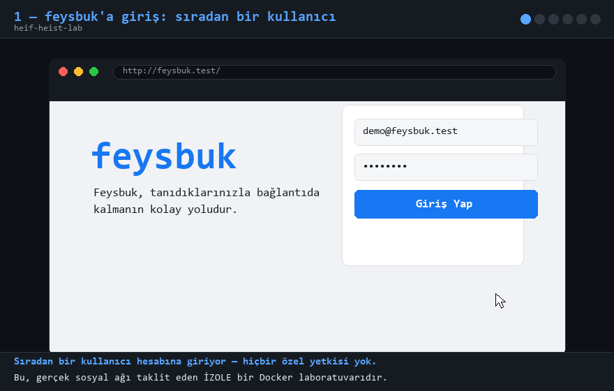

# Feysbuk — HEIF Heist Laboratuvarı 🧪


> **EN TL;DR:** A mini "Facebook" in Docker whose image pipeline runs a
> *deliberately vulnerable* libheif 1.17.6. Upload one crafted HEIC and the
> decoder copies **9216 bytes from a 96-byte buffer** — the overshoot (adjacent
> heap, containing fake admin secrets) lands **in your profile picture pixels**.
> A faithful local reproduction of the **HEIF Heist** class of bugs
> (Meta paid **$115,000** for RCE via HEIC upload, Sept 2026). Educational, isolated, fake data.

Docker'da çalışan, **kasıtlı olarak zafiyetli** mini bir Facebook klonu
(PHP + Apache + MariaDB). Amaç: **HEIF Heist** olayında Facebook/Instagram'ı
vuran zafiyet sınıfını — crafted HEIC görsel yükleme ile sunucu tarafı
görüntü pipeline'ında bellek bozulması ve **heap disclosure** — kendi
laboratuvarınızda canlı yeniden üretmek.



> **Bu bir eğitim laboratuvarıdır.** Tüm veriler sahtedir; yalnızca kendi
> bilgisayarınızdaki izole Docker ortamında çalıştırın. Başkalarının
> sistemlerinde bu teknikleri kullanmak yasadışıdır.

---

## Gerçek olay: HEIF Heist (Eylül 2026)

Araştırma ekibi **Hacktron** ([Harsh Jaiswal @rootxharsh](https://x.com/rootxharsh)
ve ekip), aylarca süren **libheif** soruşturmasında aynı görüntü decoder
sınıfını kullanarak **OpenAI, Slack, Meta (Facebook/Instagram), GitHub
Enterprise, Rails ve Next.js** sistemlerini hacklediler. Facebook/Instagram'da
crafted **HEIC/HEIF görsel yüklemesi** ile ulaştıkları **RCE** için Meta
**$100.000 bounty + %15 Platinum bonusu = $115.000** ödedi
([heif-heist.com](https://heif-heist.com)).

Meta'nın ödeme gerekçesindeki teknik ifade (birebir):
> *"a memory corruption issue in HEIC/HEIF handling during server-side image
> conversion, which can lead to out-of-bounds read/write and potential remote
> code execution"*

Bu laboratuvar aynı sınıfı, halka açık bir **n-day** ile yeniden üretir:

| | |
|---|---|
| Zafiyet | **CVE-2025-46087** — libheif `UncompressedImageCodec::decode_uncompressed_image()` sınır kontrolsüz `memcpy` ([strukturag/libheif#1508](https://github.com/strukturag/libheif/issues/1508)) |
| Etkilenen | libheif ≤ 1.17.6 (1.18.0'da düzeltildi) |
| Sınıf | CWE-125/CWE-787 (out-of-bounds read/write) → DoS + **heap disclosure** (+ heap grooming ile RCE yolu — HEIF Heist'in gösterdiği gibi) |
| Aynı dönemin 0-day'i | CVE-2026-84383 (libheif ≤ 1.23.1, `scale_nearest_neighbor`, sharp < 0.35.4) — aynı araştırmacı, onaylanmış Linux RCE |

## Saldırının hikâyesi (tek paragraf)

Sıradan bir kullanıcı, profil fotoğrafı olarak **sahte bir HEIC** yükler:
dosya decoder'a "96×96 pikselim var" der ama yalnızca **96 bayt** veri taşır.
Pipeline'daki hatalı kod uzunluğu ispe'den okuyup **kontrol etmeden
9216 bayt kopyalar** — eksik 9120 bayt **komşu heap bellekten** gelir.
Kopyalanan her bayt, decoder çıktısına yazıldığı için saldırganın
**profil fotoğrafı**, sunucunun belleğinin karesine dönüşür. Ve o bellekte,
tıpkı gerçek sunucularda olduğu gibi, **yönetici kimlik bilgileri** yaşar.

## Hızlı başlangıç

```bash
docker compose up -d --build   # ilk derleme ~5 dk (libheif iki kez derlenir)
```

- Uygulama: **http://localhost:8080**
- Demo hesabı: `demo@feysbuk.test` / `demo1234` (hiçbir ayrıcalığı yok)

## 5 dakikalık demo senaryosu (kayıt için)

1. Giriş yap; **Profil Fotoğrafı (HEIC)** kartına `heiflab/poc/benign.heic`
   yükle → pipeline normal: temiz gradyan avatar.
2. `heiflab/poc/crash.heic` yükle → pipeline "başarılı" der ama avatar artık
   **sunucu belleğinin karesidir**: piksellerin içinde yönetici kimlik
   bilgileri gizlidir. *(docs/screenshots/02-03)*
3. Otomatik anlatım:
   ```bash
   python exploit/heif_exploit.py
   ```
   → benign yükleme (temiz) → crafted yükleme → avatar piksellerinden
   `Sup3rS3cret!2026` çalınır → ASAN `heap-buffer-overflow READ` kanıtı.
4. Kod hikâyesi: `heiflab/heifconv.c` (pipeline) + libheif 1.17.6'daki tek
   satırlık hata: `memcpy(dst, data.data(), width*height)` — **uzunluk
   kontrolsüz**.
5. Yama nasıl olurdu: libheif ≥ 1.18'e yükseltmek (her iki derleme için) veya
   decoder'ı başlangıçta engellemek (örn. sharp'ta
   `sharp.block({operation:['VipsForeignLoadHeif']})`).

## Zafiyet zinciri (teknik özet)

```
[attacker]   POST /upload.php  (crafted .heic: 'unci' 96x96 ilan eder, 96 bayt veri)
   └─ shell_exec: heifconv --secret-file /var/www/secret/admin_credentials.txt
        └─ groom: gizli dosya içeriği 120 KB'lik heap bloğuna doldurulup
             free() edilir → sonraki tüm tahsisatlar bu bloktan oyulur
             (unsorted-bin/last-remainder grooming → sızıntı deterministik)
        └─ libheif 1.17.6 decode:
             bytes_per_channel = width * height = 96*96 = 9216   // ispe'den
             memcpy(dst, data.data(), 9216)                       // data.size()=96!
             → 9120 bayt komşu heap dst düzlemine KOPYALANIR
   └─ avatar BMP = görselleşmiş heap dump
[attacker]   GET /download.php?f=avatars/avatar_1.bmp  →  piksellerde sır 🎉
```

`craft_heic.py` PoC dosyalarını üretir. Kutu yapısı (minimal 'unci' HEIF):
`ftyp / meta[hdlr, pitm, iinf('unci'), iprp[ipco(ispe,cmpd,uncC), ipma], iloc] / mdat`.
Kritik nokta: **uncC interleave=0 (planar)** dalında `stride == width` olduğundan
tek `memcpy` çalışır — sızan blok baştan sona bitişik heap'tir.

## Proje yapısı

```
docker-compose.yml          # web (php:8.2-apache + libheif 1.17.6) + db (mariadb)
app/Dockerfile              # libheif 1.17.6 düz + ASAN derlemesi, heifconv
app/html/                   # index, home, upload, download, logout, style
app/seed.sql                # sahte kullanıcılar + gönderiler
heiflab/craft_heic.py       # crafted HEIC üreticisi (benign + crash)
heiflab/heifconv.c          # sunucu pipeline'ı (grooming'li dönüştürücü)
heiflab/poc/                # üretilmiş PoC dosyaları
exploit/heif_exploit.py     # 3 perdeli HEIC heist sömürüsü
docs/linkedin_post.md       # hazır LinkedIn taslağı + video senaryosu
docs/screenshots/           # 01 çalınan bellek avatarı, 02 akış, 03 yakın plan
secret/                     # /var/www/secret — belleğe yüklenen sahte gizli dosyalar
```

## Komutlar

```bash
docker compose up -d --build     # başlat (ilk sefer ~5 dk)
python exploit/heif_exploit.py   # HEIC heist (başarılı = exit 0)
python heiflab/craft_heic.py     # PoC dosyalarını yeniden üret
docker compose down              # durdur
```

## Gerçek dünya referansları

- HEIF Heist duyurusu ve kapsamı: https://heif-heist.com ·
  [Harsh Jaiswal (@rootxharsh)](https://x.com/rootxharsh) ·
  [Meta ödül haberi](https://officechai.com/stories/harsh-jaiswal-gets-100000-bug-bounty-from-meta-for-finding-similar-exploits-as-the-openai-hack)
- CVE-2025-46087 (bizim n-day): [libheif#1508](https://github.com/strukturag/libheif/issues/1508) — 1.17.6'da doğrulandı, 1.18.0'da düzeltildi
- CVE-2026-84383 (aynı ekibe 0-day RCE, libheif ≤ 1.23.1):
  [GHSA-g89c-p67h-r497](https://github.com/advisories/GHSA-g89c-p67h-r497) ·
  [securelayer7 lab](https://securelayer7.net/lab/cve-2026-84383-sharp-libheif-heap-buffer-overflow-avif-rce)
- Next.js image-optimization AVIF RCE zinciri: GHSA-2xp9-vwfh-vxw4
- CWE-125 OOB Read · CWE-787 OOB Write

## Sorumluluk

Bu proje yalnızca savunma amaçlı güvenlik eğitimi için tasarlanmıştır;
korunan sistemlere izinsiz test yapmak suçtur. Tüm veriler kurgusaldır.
